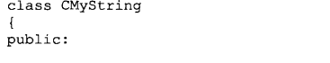

<html>
<head>
  <title>剑指offer之为类添加赋值运算符的函数</title>
  <basefont face="微软雅黑" size="2" />
  <meta http-equiv="Content-Type" content="text/html;charset=utf-8" />
  <meta name="exporter-version" content="Evernote Windows/302292 (zh-CN); Windows/10.0.10586 (Win64);"/>
  
</head>
<body>
<a name="1909"/>
<h1>剑指offer之为类添加赋值运算符的函数</h1>

<b>题目：下面这是一个CMystring类型的声明，请为该类型添加赋值运算符函数；</b>

<b>首先分析：</b>

<b>本题考查一下几点知识；</b>

（1）要知道运算符重载的书写方式（其实就是函数重载）只是用到了operator+运算符这样的形式来定义函数；

（2）比较特殊的运算符重载的注意事项：（这里一赋值运算符为例）

赋值运算符的重载要注意一下几点：

<b>1&gt;要注意函数的返回值：</b>函数的返回值必须是该类的的引用类型（为什么呢？因为往往赋值运算符是需要连续赋值的，也就是说赋值运算符调用的返回结果还能够继续调用赋值运算符；这样就必须要求返回值为该类型的应用）

<b>2&gt;要注意判断传入的参数是不是当前的实例</b>，如果是就不用进行成员的拷贝，直接返回*this（注意是*this，因为this是一个指针）

<b>3&gt;要注意在这个类型当中有没有新开辟内存空间</b>（也就是有没有指针类型的数据），如果有，就要先释放掉原来的空间，在来拷贝到新申请的空间中；这样做是为了避免内存泄漏的问题；

做到了以上三点注意对于初级程序员来说就足够了：

下面就来写一下这个赋值运算符函数：

CMystring&amp; operator=（const CMystring &amp;str）

{

     if（&amp;str==this）

          return *this；

     delete []m_pData；

     m_pData=NULL;

     m_pData=new char[strlen(str.m_pData)+1]；

     strcpy(m_pData，str.m_pData);

     return *this;

}

这种写法还不是很完美的，对于高级程序员来说；还应该考虑到内存分配new的安全性，有可能new没有成功；具体的解法看一下剑指offer上面的解析；

 

 

 

 

</body></html>
