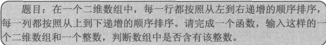

<html>
<head>
  <title>剑指offer之二维数组中的查找</title>
  <basefont face="微软雅黑" size="2" />
  <meta http-equiv="Content-Type" content="text/html;charset=utf-8" />
  <meta name="exporter-version" content="Evernote Windows/302292 (zh-CN); Windows/10.0.10586 (Win64);"/>
  
</head>
<body>
<a name="1917"/>
<h1>剑指offer之二维数组中的查找</h1>

这个题目如下：

这是一个特殊的二维数组：

 

 

二维数组的准备知识；

（1）如果要用c语言的二维数组；就要熟悉二维数组中的两个概念：

1&gt;数组指针：表示指向数组的指针，声明的方法是：int （*parr）[4]；这就是声明了一个指向有4个元素的数组的指针；注意这个parr不等价与int **parr；这一点与char类型有所不同；

2&gt;指针数组：表示一个数组中存放的元素是指针：声明的方法是：int *parr[4];这就表示parr是一个数组这个数组有4个元素，这些元素都是int*类型的；

（2）明白了这两个概念之后，还有注意一下几点关于指针与二维数组的转换问题：

1&gt;二维数组的数组名其实就是一个指针是一个指向二维数组第一行的指针；所以在解有关二维数组的题目可以将二维数组的名转换为一个数组指针；

2&gt;如果想把二维数组作为参数传递个某个函数，一定要注意转换；注意，int **p与int （*p）[n]这两个是不同的；

所以我们在函数的定义中一般会写int **p，而不会写成int（*p）[n]；比如：void function（int **p，...）;

所以我们在调用这个函数的时候，要讲数组名强制转换为**p类型；

 

3&gt;所以接下来就会有一个新的问题，那就是**p与数组元素的定位：

这里只能铜鼓指针的解引用来获取二维数组中的元素：

解引用 的规则是这样的：

 

比如在数组a[m][n]：如果要获取a[i][j]这个元素，那么用解引用来获取就是这样的：

int （*p）[n]=a;

a[i][j]就等价于*（（int*）p+n*i+j）;

 

当然如果用c++中的vector来实现二维数组，题目就避免了很多麻烦的指针操作；会省去很多功夫；

为了进一步的熟悉c（c++）中的指针，这道题目我们选择用纯c语言实现：

 

 

接下来回到这个题目中来，

这道题目的解答思路在剑指offer中已经写的很详细了：

 

下面就给出纯c语言的实现：

</body></html>
